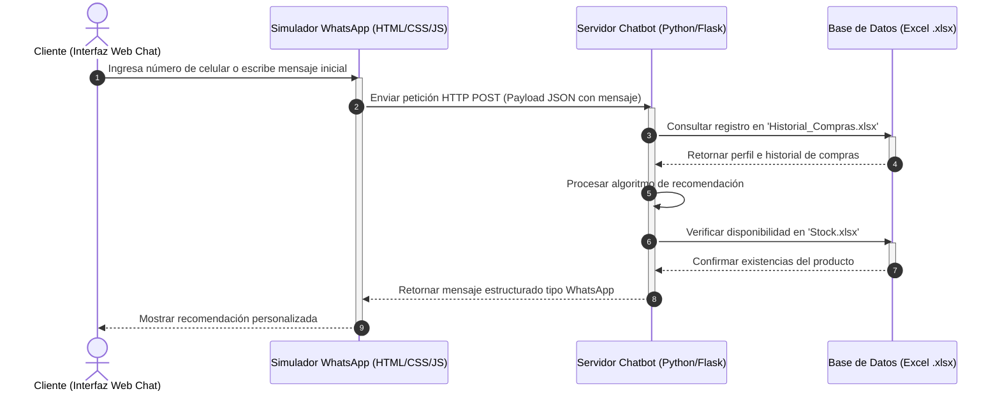

<div align="center">

# Arquitectura Base del Sistema

### Simulación Web de Chatbot de Recomendaciones para Tambo+

---

</div>

# 1. Tipo de Solución

> La solución consiste en una simulación web de un chatbot de recomendaciones para Tambo+, utilizando archivos locales de Microsoft Excel como mecanismo de almacenamiento y persistencia de datos.

<br>

<table>
<tr>
<td width="50%">

### Características del Sistema

- Mensajes de texto.
- Flujos interactivos de opciones.
- Respuestas dinámicas.
- Recomendaciones personalizadas.

</td>

<td width="50%">

### Enfoque de la Solución

El sistema emula exclusivamente la interfaz conversacional de WhatsApp Business, priorizando una experiencia tipo chat sobre interfaces tradicionales de comercio electrónico.

</td>
</tr>
</table>

<details>
<summary><strong>Objetivo principal de la solución</strong></summary>

```text
Simular un chatbot inteligente de recomendaciones
para Tambo+ utilizando una experiencia conversacional
similar a WhatsApp Business.
```

</details>

---

# 2. Arquitectura General del Sistema

> El sistema se encuentra organizado bajo una arquitectura desacoplada de tres capas principales.

<table>
<tr>
<td width="60%">

### Capas Principales

1. Capa de Presentación.
2. Capa de Lógica del Sistema.
3. Capa de Persistencia de Datos.

</td>

<td width="40%">

### Componente Adicional

Además, se contempla un componente backend encargado de exponer servicios y procesar la lógica conversacional.

</td>
</tr>
</table>

---

## Distribución Arquitectónica

| Capa | Responsabilidad Principal |
|---|---|
| Presentación | Interacción visual con el usuario |
| Lógica del Sistema | Procesamiento conversacional y recomendaciones |
| Persistencia de Datos | Almacenamiento y consulta de información |

<details>
<summary><strong>Vista simplificada de la arquitectura</strong></summary>

```text
Usuario
   ↓
Interfaz Web (Frontend)
   ↓
Backend Conversacional
   ↓
Archivos Excel (.xlsx)
```

</details>

---

## 2.1 Diagrama de Arquitectura

``````mermaid
graph TD
    %% ==========================================
    %% CAPA DE PRESENTACIÓN
    %% ==========================================
    subgraph Frontend [1. Capa de Presentación / Interfaces Web]
        A[Interfaz Web Cliente<br/>Chat simulado tipo WhatsApp]
        B[Dashboard Administrativo<br/>Productos, conversaciones y métricas]
    end

    %% ==========================================
    %% BACKEND MONOLÍTICO FLASK
    %% ==========================================
    subgraph Backend [2. Aplicación Monolítica Flask]
        C[API Flask<br/>Rutas HTTP / Endpoints JSON]

        subgraph Controladores [Capa de Controladores / Enrutamiento]
            D[ChatController<br/>/api/chat]
            E[AdminController<br/>/api/metricas]
            F[ProductoController<br/>/api/productos]
        end

        subgraph Servicios [Capa de Servicios / Lógica de Negocio]
            G[ChatbotService<br/>Procesamiento conversacional e intenciones]
            H[ProductoService<br/>Consulta y filtrado de catálogo]
            I[RecomendacionService<br/>Reglas básicas y cruce de datos]
            J[MetricaService<br/>Consultas frecuentes y estadísticas]
        end

        subgraph Repositorios [Capa de Acceso a Datos / Repositorios]
            K[ProductoRepository<br/>Lector de Catálogo y Stock]
            L[ConversacionRepository<br/>Gestor de Historial CRM]
            M[MensajeRepository<br/>Gestor de Logs del Chat]
            N[MetricaRepository<br/>Acumulador de Estadísticas]
        end
    end

    %% ==========================================
    %% CAPA DE PERSISTENCIA
    %% ==========================================
    subgraph Persistencia [3. Capa de Datos / Persistencia Local Excel]
        O[(Productos.xlsx<br/>Catálogo Maestro)]
        P[(Promociones.xlsx<br/>Combos y Ofertas)]
        Q[(Stock.xlsx<br/>Inventario por Unidades)]
        R[(Historial_Compras.xlsx<br/>CRM Transaccional)]
        S[(Interacciones_Chatbot.xlsx<br/>Logs de Mensajes)]
    end

    %% ==========================================
    %% FLUJOS DE COMUNICACIÓN Y DEPENDENCIAS
    %% ==========================================

    %% Del Frontend a la API
    A -->|1. Envía mensaje JSON| C
    B -->|Solicita datos analíticos| C

    %% De la API a los Controladores
    C --> D
    C --> E
    C --> F

    %% De los Controladores a los Servicios
    D --> G
    E --> J
    F --> H

    %% Relaciones internas entre Servicios
    G --> H
    G --> I

    %% Servicios a Repositorios
    H --> K
    I --> K
    I --> L
    G --> L
    G --> M
    J --> L
    J --> M
    J --> N

    %% Repositorios a Excel
    K --> O
    K --> P
    K --> Q
    L --> R
    M --> S
    N --> S

    %% ==========================================
    %% ESTILOS VISUALES
    %% ==========================================
    style Frontend fill:#ffffff,stroke:#25D366,stroke-width:2px
    style Backend fill:#ffffff,stroke:#333333,stroke-width:2px
    style Controladores fill:#fafafa,stroke:#666666,stroke-width:1px
    style Servicios fill:#fafafa,stroke:#666666,stroke-width:1px
    style Repositorios fill:#fafafa,stroke:#666666,stroke-width:1px
    style Persistencia fill:#ffffff,stroke:#217346,stroke-width:2px
```
# 3. Descripción de las Capas del Sistema

---

## 3.1 Capa de Presentación

> Encargada de la interacción directa con el usuario mediante una interfaz web que simula el comportamiento visual y conversacional de WhatsApp Business.

<table>
<tr>
<td width="50%">

### Funciones Principales

- Mostrar mensajes del chatbot.
- Simular conversaciones en tiempo real.
- Capturar entradas del usuario.
- Gestionar botones y listas interactivas.
- Enviar solicitudes HTTP al backend.

</td>

<td width="50%">

### Tecnologías Utilizadas

| Tecnología | Función |
|---|---|
| HTML5 | Estructura de la interfaz |
| CSS3 | Diseño visual y estilos |
| JavaScript | Interactividad y eventos |

</td>
</tr>
</table>

<details>
<summary><strong>Flujo de interacción de la interfaz</strong></summary>

```text
Usuario → Interfaz Web → Captura de mensaje → Envío HTTP → Backend
```

</details>

---

## 3.2 Capa de Lógica del Sistema

> Responsable del procesamiento principal del chatbot y de toda la lógica conversacional del sistema.

### Componentes Principales

| Componente | Función |
|---|---|
| Controlador Conversacional | Administra el flujo de mensajes y estados de la conversación |
| Motor de Búsqueda de Productos | Consulta información de productos almacenados en Excel |
| Módulo de Promociones | Filtra ofertas y promociones activas |
| Algoritmo de Recomendaciones | Genera sugerencias personalizadas según historial y preferencias |

---

### Factores Utilizados por el Algoritmo de Recomendación

<table>
<tr>
<td align="center" width="25%">

#### Historial
Analiza compras anteriores del usuario.

</td>

<td align="center" width="25%">

#### Frecuencia
Detecta patrones de consumo.

</td>

<td align="center" width="25%">

#### Preferencias
Identifica productos consultados.

</td>

<td align="center" width="25%">

#### Stock
Verifica disponibilidad en inventario.

</td>
</tr>
</table>

---

### Tecnologías Utilizadas

| Tecnología | Uso |
|---|---|
| Python | Procesamiento del chatbot |
| Flask | Exposición de servicios backend |

<details>
<summary><strong>Proceso interno de recomendación</strong></summary>

```text
Consulta de historial
        ↓
Análisis de preferencias
        ↓
Cruce con promociones activas
        ↓
Validación de stock
        ↓
Generación de recomendación personalizada
```

</details>

---

## 3.3 Capa de Persistencia de Datos

La persistencia se realiza mediante archivos `.xlsx`, los cuales simulan una base de datos estructurada.

### Archivos utilizados

| Archivo | Descripción |
|---|---|
| `Productos.xlsx` | Información general de productos |
| `Promociones.xlsx` | Registro de promociones vigentes |
| `Stock.xlsx` | Control de disponibilidad de inventario |
| `Historial_Compras.xlsx` | Historial de compras de clientes |
| `Interacciones_Chatbot.xlsx` | Registro de conversaciones y auditoría |

---

# 4. Flujo de Datos y Secuencia Operativa

El siguiente diagrama describe el flujo de interacción entre el cliente, la interfaz web, el backend y los archivos de persistencia.

## 4.1 Diagrama de Secuencia



---

# 5. Especificación de Mensajería del Simulador

La comunicación entre el frontend y el backend se realiza mediante estructuras JSON que simulan el comportamiento de WhatsApp Business.

## 5.1 Mensaje de Entrada

```json
{
  "sender_phone": "999888777",
  "message_body": "Quiero ver las ofertas de hoy",
  "timestamp": "2026-05-25T01:15:00Z"
}
```

### Descripción de campos

| Campo | Descripción |
|---|---|
| `sender_phone` | Número de teléfono del usuario |
| `message_body` | Contenido del mensaje enviado |
| `timestamp` | Fecha y hora del mensaje |

---

## 5.2 Mensaje de Salida Estructurado

```json
{
  "recipient_phone": "999888777",
  "message_type": "interactive_list",
  "body_text": "Hola Alexander, basado en tu compra frecuente de los viernes, te sugerimos este combo exclusivo para ti:",
  "options": [
    {
      "id": "combo_01",
      "title": "Aceptar Combo Sugerido"
    },
    {
      "id": "cat_gen",
      "title": "Ver Catálogo General"
    }
  ]
}
```

### Descripción de campos

| Campo | Descripción |
|---|---|
| `recipient_phone` | Número del destinatario |
| `message_type` | Tipo de mensaje interactivo |
| `body_text` | Texto principal enviado por el chatbot |
| `options` | Lista de opciones interactivas |

---
# 6. Beneficios de la Arquitectura

> La arquitectura propuesta ofrece diversas ventajas tanto a nivel académico como técnico, permitiendo desarrollar un sistema organizado, modular y fácil de mantener.

<table>
<tr>
<td width="50%">

### Beneficios Técnicos

- Separación clara de responsabilidades.
- Facilidad de mantenimiento.
- Escalabilidad modular.
- Persistencia simple mediante Excel.
- Posibilidad de migrar posteriormente a bases de datos reales.

</td>

<td width="50%">

### Beneficios Funcionales

- Simulación realista de WhatsApp Business.
- Facilidad de implementación académica.
- Bajo costo de infraestructura.
- Organización eficiente de componentes.
- Mayor facilidad para realizar mejoras futuras.

</td>
</tr>
</table>

<details>
<summary><strong>Impacto de la arquitectura propuesta</strong></summary>

```text
Arquitectura desacoplada
            ↓
Mayor organización del sistema
            ↓
Facilidad de mantenimiento y escalabilidad
            ↓
Posibilidad de evolución tecnológica futura
```

</details>

---

# 7. Posibles Mejoras Futuras

> El sistema puede evolucionar incorporando nuevas tecnologías y funcionalidades más avanzadas en futuras versiones.

## Mejoras Propuestas

| Área | Posible Mejora |
|---|---|
| Integración | APIs reales de WhatsApp Business |
| Persistencia | Uso de MySQL o PostgreSQL |
| Inteligencia Artificial | Recomendaciones avanzadas |
| Administración | Panel de gestión de productos y promociones |
| Seguridad | Autenticación de usuarios |
| Analítica | Dashboards y métricas del sistema |
| Comercio Digital | Integración con pasarelas de pago |
| Infraestructura | Despliegue en servicios cloud |

---

## Evolución Esperada del Sistema

```text
Versión Académica
        ↓
Sistema Modular Funcional
        ↓
Integración con Servicios Reales
        ↓
Escalabilidad Empresarial
```

---
