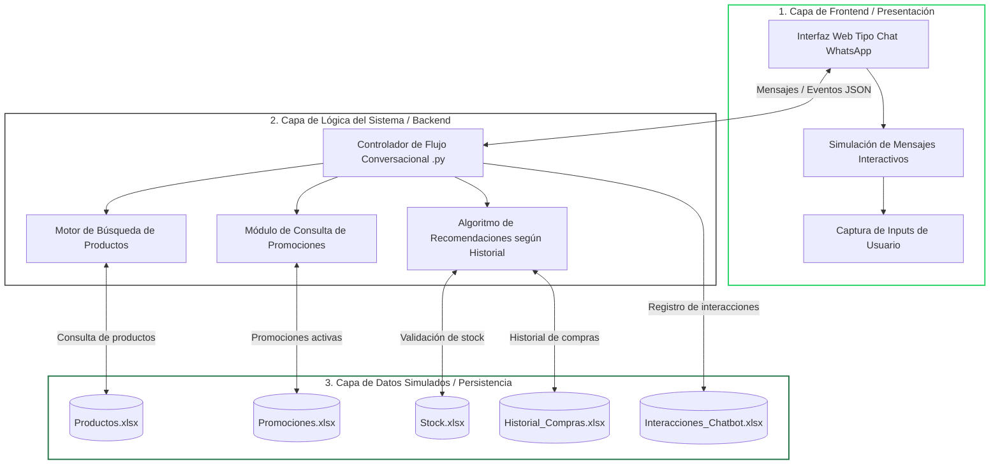
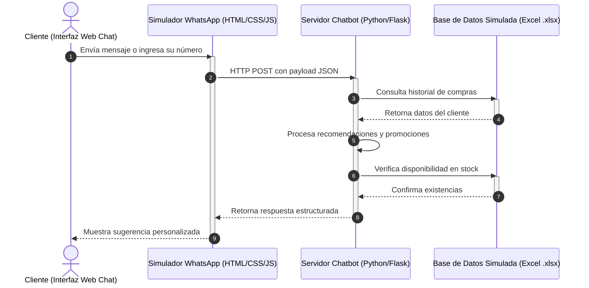

# Arquitectura Base del Sistema

## 1. Descripción General de la Solución

El proyecto consiste en el desarrollo de una simulación web de un chatbot de recomendaciones para Tambo+, diseñada bajo una experiencia conversacional similar a WhatsApp Business.

La solución permite que el usuario interactúe mediante mensajes de texto, opciones dinámicas y respuestas automatizadas, simulando una conversación natural con un asistente virtual.

A diferencia de una plataforma de comercio electrónico tradicional, el sistema se enfoca completamente en la interacción conversacional, ofreciendo recomendaciones de productos, promociones y sugerencias personalizadas según el historial del cliente.

La información del sistema será almacenada en archivos locales de Microsoft Excel (`.xlsx`), utilizados como mecanismo de persistencia y simulación de base de datos.

---

# 2. Arquitectura General del Sistema

La arquitectura del sistema se encuentra dividida en tres capas principales, permitiendo mantener una estructura organizada, modular y fácil de mantener.

## 2.1 Estructura Arquitectónica



---

# 3. Descripción de las Capas

## 3.1 Capa de Presentación

La capa de presentación corresponde a la interfaz visual con la que interactúa el usuario.

Su objetivo principal es simular el entorno conversacional de WhatsApp Business, permitiendo enviar mensajes, visualizar respuestas y seleccionar opciones interactivas de manera intuitiva.

### Funciones principales

- Mostrar mensajes del chatbot.
- Simular conversaciones en tiempo real.
- Capturar mensajes ingresados por el usuario.
- Mostrar botones y listas interactivas.
- Enviar solicitudes al backend mediante HTTP.

### Tecnologías propuestas

- HTML5
- CSS3
- JavaScript

---

## 3.2 Capa de Lógica del Sistema

Esta capa contiene el procesamiento principal del chatbot y la lógica encargada de generar respuestas dinámicas.

Aquí se controlan las recomendaciones, las promociones y el flujo completo de la conversación.

### Componentes principales

### Controlador Conversacional

Administra el flujo de mensajes entre el usuario y el sistema, interpretando cada interacción realizada desde la interfaz web.

### Motor de Búsqueda de Productos

Realiza consultas sobre los productos disponibles registrados en los archivos Excel.

### Módulo de Promociones

Identifica promociones activas y ofertas disponibles según las condiciones establecidas.

### Algoritmo de Recomendaciones

Genera recomendaciones personalizadas utilizando:

- Historial de compras.
- Frecuencia de consumo.
- Preferencias detectadas.
- Disponibilidad de stock.
- Productos consultados anteriormente.

### Tecnologías propuestas

- Python
- Flask

---

## 3.3 Capa de Persistencia de Datos

La persistencia del sistema se realiza mediante archivos Excel (`.xlsx`), utilizados como almacenamiento estructurado de información.

Cada archivo cumple una función específica dentro del sistema.

| Archivo | Función |
|---|---|
| `Productos.xlsx` | Almacena información de productos |
| `Promociones.xlsx` | Contiene promociones y ofertas activas |
| `Stock.xlsx` | Registra disponibilidad de inventario |
| `Historial_Compras.xlsx` | Guarda el historial de compras del cliente |
| `Interacciones_Chatbot.xlsx` | Registra conversaciones y auditoría |

---

# 4. Flujo de Funcionamiento del Sistema

El siguiente diagrama muestra el proceso completo desde que el usuario envía un mensaje hasta que el sistema devuelve una recomendación personalizada.

## 4.1 Diagrama de Secuencia



---

# 5. Comunicación entre Frontend y Backend

La comunicación entre el simulador web y el backend se realizará mediante estructuras JSON, simulando el comportamiento de la API de WhatsApp Business.

---

## 5.1 Ejemplo de Mensaje de Entrada

```json
{
  "sender_phone": "999888777",
  "message_body": "Quiero ver las ofertas de hoy",
  "timestamp": "2026-05-25T01:15:00Z"
}
```

### Descripción de campos

| Campo | Descripción |
|---|---|
| `sender_phone` | Número telefónico del cliente |
| `message_body` | Mensaje enviado por el usuario |
| `timestamp` | Fecha y hora de la interacción |

---

## 5.2 Ejemplo de Mensaje de Salida

```json
{
  "recipient_phone": "999888777",
  "message_type": "interactive_list",
  "body_text": "Hola Alexander, basado en tus compras frecuentes, tenemos esta recomendación para ti:",
  "options": [
    {
      "id": "combo_01",
      "title": "Aceptar recomendación"
    },
    {
      "id": "catalogo",
      "title": "Ver catálogo general"
    }
  ]
}
```

### Descripción de campos

| Campo | Descripción |
|---|---|
| `recipient_phone` | Número del destinatario |
| `message_type` | Tipo de mensaje interactivo |
| `body_text` | Contenido principal del mensaje |
| `options` | Opciones disponibles para el usuario |

---

# 6. Ventajas de la Arquitectura Propuesta

La arquitectura planteada permite desarrollar un sistema organizado y escalable, facilitando tanto la implementación como el mantenimiento del proyecto.

### Principales ventajas

- Separación clara de responsabilidades.
- Mayor facilidad de mantenimiento.
- Arquitectura modular.
- Simulación realista de WhatsApp Business.
- Persistencia simple mediante archivos Excel.
- Facilidad para realizar pruebas y mejoras.
- Posibilidad de migrar posteriormente a bases de datos reales.

---

# 7. Posibles Mejoras Futuras

El sistema puede ampliarse posteriormente incorporando nuevas funcionalidades y tecnologías más avanzadas.

### Mejoras propuestas

- Integración con la API oficial de WhatsApp Business.
- Uso de bases de datos relacionales.
- Panel administrativo web.
- Implementación de inteligencia artificial.
- Recomendaciones más precisas mediante análisis de datos.
- Integración con métodos de pago.
- Despliegue en servicios cloud.

---

# 8. Tecnologías Utilizadas

| Componente | Tecnología |
|---|---|
| Frontend | HTML, CSS, JavaScript |
| Backend | Python, Flask |
| Persistencia | Microsoft Excel (.xlsx) |
| Comunicación | HTTP + JSON |
| Interfaz Conversacional | Simulación WhatsApp Web |

---

# 9. Conclusión

La arquitectura desarrollada permite implementar una simulación funcional de un chatbot inteligente para Tambo+, enfocada en recomendaciones y atención personalizada mediante una experiencia conversacional similar a WhatsApp Business.

El uso de una estructura desacoplada facilita la organización del sistema y permite que el proyecto pueda evolucionar fácilmente hacia soluciones más robustas en el futuro.
