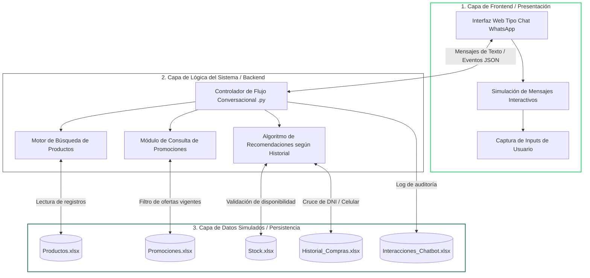
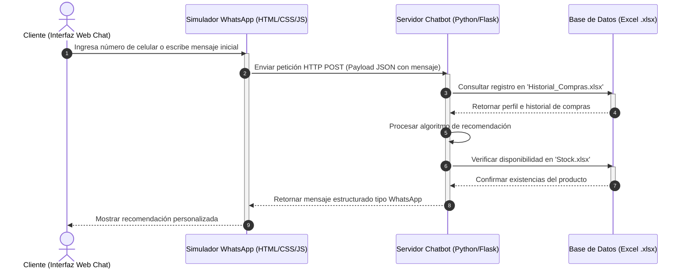

# Arquitectura Base del Sistema

## 1. Tipo de Solución

La solución consiste en una simulación web de un chatbot de recomendaciones para Tambo+, utilizando archivos locales de Microsoft Excel como mecanismo de almacenamiento y persistencia de datos.

El sistema emula exclusivamente la interfaz conversacional de WhatsApp Business, permitiendo procesar:

- Mensajes de texto.
- Flujos interactivos de opciones.
- Respuestas dinámicas.
- Recomendaciones personalizadas.

La arquitectura evita el uso de interfaces tradicionales de comercio electrónico y se enfoca completamente en una experiencia conversacional tipo chat.

---

# 2. Arquitectura General del Sistema

El sistema se encuentra organizado bajo una arquitectura desacoplada de tres capas principales:

1. Capa de Presentación.
2. Capa de Lógica del Sistema.
3. Capa de Persistencia de Datos.

Además, se contempla un componente backend encargado de exponer servicios y procesar la lógica conversacional.

## 2.1 Diagrama de Arquitectura



---

# 3. Descripción de las Capas del Sistema

## 3.1 Capa de Presentación

La capa de presentación se encarga de la interacción directa con el usuario mediante una interfaz web que simula el comportamiento visual y conversacional de WhatsApp Business.

### Responsabilidades principales

- Mostrar mensajes del chatbot.
- Simular globos de conversación.
- Capturar entradas del usuario.
- Gestionar botones y listas interactivas.
- Enviar solicitudes HTTP al backend.

### Tecnologías sugeridas

- HTML5
- CSS3
- JavaScript

---

## 3.2 Capa de Lógica del Sistema

La capa lógica contiene el procesamiento principal del chatbot y administra el flujo conversacional.

### Componentes principales

#### Controlador Conversacional

Gestiona el estado de la conversación y procesa los mensajes recibidos desde la interfaz web.

#### Motor de Búsqueda de Productos

Consulta productos almacenados en archivos Excel y obtiene información relevante para el usuario.

#### Módulo de Promociones

Filtra promociones activas y determina ofertas vigentes según la fecha y condiciones comerciales.

#### Algoritmo de Recomendaciones

Genera recomendaciones personalizadas utilizando:

- Historial de compras.
- Frecuencia de consumo.
- Preferencias detectadas.
- Disponibilidad de stock.

### Tecnologías sugeridas

- Python
- Flask

---

## 3.3 Capa de Persistencia de Datos

La persistencia se realiza mediante archivos `.xlsx`, los cuales simulan una base de datos estructurada.

### Archivos utilizados

| Archivo | Descripción |
|---|---|
| `Productos.xlsx` | Información general de productos |
| `Promociones.xlsx` | Registro de promociones vigentes |
| `Stock.xlsx` | Control de disponibilidad de inventario |
| `Historial_Compras.xlsx` | Historial de compras de clientes |
| `Interacciones_Chatbot.xlsx` | Registro de conversaciones y auditoría |

---

# 4. Flujo de Datos y Secuencia Operativa

El siguiente diagrama describe el flujo de interacción entre el cliente, la interfaz web, el backend y los archivos de persistencia.

## 4.1 Diagrama de Secuencia



---

# 5. Especificación de Mensajería del Simulador

La comunicación entre el frontend y el backend se realiza mediante estructuras JSON que simulan el comportamiento de WhatsApp Business.

## 5.1 Mensaje de Entrada

```json
{
  "sender_phone": "999888777",
  "message_body": "Quiero ver las ofertas de hoy",
  "timestamp": "2026-05-25T01:15:00Z"
}
```

### Descripción de campos

| Campo | Descripción |
|---|---|
| `sender_phone` | Número de teléfono del usuario |
| `message_body` | Contenido del mensaje enviado |
| `timestamp` | Fecha y hora del mensaje |

---

## 5.2 Mensaje de Salida Estructurado

```json
{
  "recipient_phone": "999888777",
  "message_type": "interactive_list",
  "body_text": "Hola Alexander, basado en tu compra frecuente de los viernes, te sugerimos este combo exclusivo para ti:",
  "options": [
    {
      "id": "combo_01",
      "title": "Aceptar Combo Sugerido"
    },
    {
      "id": "cat_gen",
      "title": "Ver Catálogo General"
    }
  ]
}
```

### Descripción de campos

| Campo | Descripción |
|---|---|
| `recipient_phone` | Número del destinatario |
| `message_type` | Tipo de mensaje interactivo |
| `body_text` | Texto principal enviado por el chatbot |
| `options` | Lista de opciones interactivas |

---

# 6. Beneficios de la Arquitectura

La arquitectura propuesta ofrece las siguientes ventajas:

- Separación clara de responsabilidades.
- Facilidad de mantenimiento.
- Escalabilidad modular.
- Simulación realista de WhatsApp Business.
- Persistencia simple mediante Excel.
- Facilidad de implementación académica.
- Bajo costo de infraestructura.
- Posibilidad de migrar posteriormente a bases de datos reales.

---

# 7. Posibles Mejoras Futuras

En futuras versiones del sistema se podrían incorporar las siguientes mejoras:

- Integración con APIs reales de WhatsApp Business.
- Uso de bases de datos relacionales como MySQL o PostgreSQL.
- Implementación de inteligencia artificial para recomendaciones avanzadas.
- Panel administrativo para gestión de productos y promociones.
- Autenticación de usuarios.
- Implementación de dashboards analíticos.
- Integración con pasarelas de pago.
- Despliegue en servicios cloud.

---

# 8. Tecnologías Propuestas

| Componente | Tecnología |
|---|---|
| Frontend | HTML, CSS, JavaScript |
| Backend | Python, Flask |
| Persistencia | Microsoft Excel (.xlsx) |
| Comunicación | JSON + HTTP POST |
| Simulación UI | WhatsApp Web Style |

---

# 9. Conclusión

La arquitectura planteada permite desarrollar una simulación funcional y modular de un chatbot de recomendaciones para Tambo+, utilizando una interfaz conversacional inspirada en WhatsApp Business y archivos Excel como mecanismo de persistencia.

El enfoque desacoplado facilita el mantenimiento del sistema, la organización de componentes y la posibilidad de escalar hacia soluciones más complejas en el futuro.
    Backend-->>Interfaz: Retorna estructura de mensaje de WhatsApp con la recomendación
    deactivate Backend
    
    Interfaz-->>Cliente: Muestra globos de diálogo interactivos con la sugerencia de compra
    deactivate Interfaz
