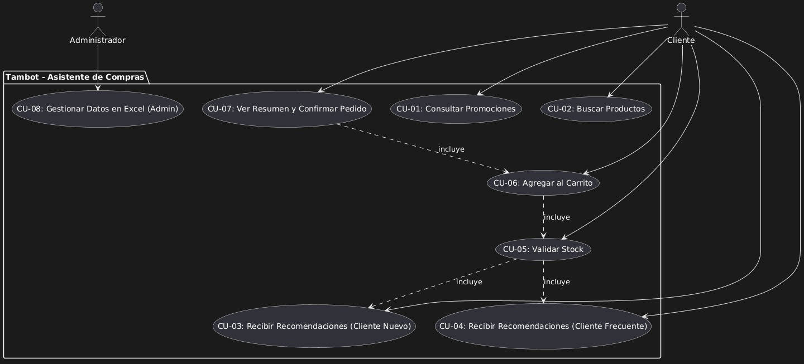

# Casos de Uso — Tambo IA Shopping Assistant (Tambot)

---

## Actores

| Actor | Descripción |
|-------|-------------|
| **Cliente** | Usuario final que interactúa con el chatbot web (Tambot) para consultar promociones, buscar productos, recibir recomendaciones, gestionar carrito y confirmar pedidos. |
| **Administrador** | Usuario interno que gestiona la información del catálogo (productos, promociones, stock, categorías) directamente en Supabase. |

---

## Diagrama de Casos de Uso (PlantUML)

## Tabla de Casos de Uso

| ID | Caso de Uso | Actor | Descripción | HU Origen | PB | Sprint |
|----|-------------|-------|-------------|-----------|----|--------|
| **CU-01** | Consultar Promociones | Cliente | Ver promociones vigentes con nombre, precio promocional y vigencia. | HU-01 | PB-01 | 1 |
| **CU-02** | Buscar Productos | Cliente | Buscar por nombre (coincidencia parcial) o categoría; ver precio, stock y opciones similares. | HU-02 | PB-02 | 1 |
| **CU-03** | Recomendaciones Cliente Nuevo | Cliente | Ver productos más vendidos (top-N) al no tener historial de compras previo. | HU-03 | PB-03 | 2 |
| **CU-04** | Recomendaciones Cliente Frecuente | Cliente | Ver productos recomendados basados en su historial de compras (productos relacionados/complementarios). | HU-04 | PB-05 | 2 |
| **CU-05** | Validar Stock | Cliente | El sistema verifica disponibilidad en tiempo real (stock > 0) antes de mostrar/agregar; sugiere alternativas si agotado. | HU-05 | PB-06 | 2 |
| **CU-06** | Agregar al Carrito | Cliente | Añadir productos (desde promociones, búsqueda o recomendaciones), especificar cantidad, validar stock, ver subtotal/total actualizado. | HU-06 | PB-04 | 1 |
| **CU-07** | Ver Resumen y Confirmar Pedido | Cliente | Revisar carrito (ítems, cantidades, precios, promociones aplicadas, total), modificar si desea, generar código de pedido simulado (UUID) y vaciar carrito. | HU-07 | PB-07 | 2 |
| **CU-08** | Gestionar Datos en Supabase | Administrador | CRUD de productos, promociones, stock y categorías vía Supabase; cambios se reflejan inmediatamente en el chatbot sin reinicio. | HU-08 | PB-08 | 2 |

---

## Relaciones entre Casos de Uso

| Relación | Descripción |
|----------|-------------|
| **CU-05 incluye CU-03 / CU-04** | La validación de stock se ejecuta dentro del flujo de recomendaciones (nuevos y frecuentes) para no sugerir productos agotados. |
| **CU-06 incluye CU-05** | Al agregar al carrito, el sistema valida stock antes de confirmar la adición. |
| **CU-07 incluye CU-06** | El resumen de pedido consolida lo agregado al carrito; no existe resumen sin carrito previo. |

---

## Resumen por Sprint

| Sprint | Casos de Uso Entregados |
|--------|-------------------------|
| **Sprint 1** | CU-01, CU-02, CU-06, CU-07 (parcial: solo carrito básico) |
| **Sprint 2** | CU-03, CU-04, CU-05, CU-07 (completo), CU-08 |

---
